<!-- Please do not change this html logo with link -->

<a target="_blank" href="https://www.microchip.com/" id="top-of-page">
   <picture>
      <source media="(prefers-color-scheme: light)" srcset="images/mchp_logo_light.png" width="350">
      <source media="(prefers-color-scheme: dark)" srcset="images/mchp_logo_dark.png" width="350">
      
   </picture>
</a>

# Audio Player and Recorder Using the PIC32CM5164JH01048 Microcontroller Based on the Arm® Cortex®-M0+ Processor

This repository provides an MPLAB® X project that showcases an audio player and recorder application, implemented using the PIC32CM JH01 Curiosity Nano and Curiosity Nano Explorer boards. The project features the PIC32CM5164JH01048 microcontroller based on the Arm® Cortex®-M0+ processor.

## Related Documentation

- [PIC32CM JH00/JH01 Data Sheet](https://ww1.microchip.com/downloads/aemDocuments/documents/MCU32/ProductDocuments/DataSheets/PIC32CM-JH00-JH01-Family-Data-Sheet-DS60001632.pdf)
- [PIC32CM JH00/JH01 Code Examples on GitHub](https://github.com/search?q=org%3AMicrochip-MPLAB-Harmony+PIC32CM_JH&type=repositories)
- [PIC32CM JH00/JH01 Resources on MPLAB Discover](https://mplab-discover.microchip.com/v2?dsl=PIC32CM+AND+JH)
- [PIC32CM JH00/JH01 Product Page](https://www.microchip.com/en-us/product/pic32cm5164jh01048)
- [PIC32CM JH01 Curiosity Nano+ Touch Evaluation Kit User Guide](https://ww1.microchip.com/downloads/aemDocuments/documents/MCU32/ProductDocuments/UserGuides/PIC32CM-JH01-Curiosity-Nano%2B-Touch-User-Guide-DS70005552.pdf)
- [Curiosity Nano Explorer User Guide](https://ww1.microchip.com/downloads/aemDocuments/documents/MCU08/ProductDocuments/UserGuides/CNANO-Explorer-UserGuide-DS50003716.pdf)

## Software Used
- [MPLAB X IDE v6.25](https://www.microchip.com/en-us/tools-resources/develop/mplab-x-ide) or newer
- [MPLAB® XC32 v5.00](https://www.microchip.com/en-us/tools-resources/develop/mplab-xc-compilers/xc32) or newer
- [PIC32CM-JH_DFP v1.5.236](https://packs.download.microchip.com/) or newer
- [MPLAB Code Configurator (MCC) v5.6.3](https://www.microchip.com/en-us/tools-resources/configure/mplab-harmony) or newer

## Hardware Used

- [PIC32CM JH01 Curiosity Nano+ Touch Evaluation Kit](https://www.microchip.com/en-us/development-tool/ev29g58a)
     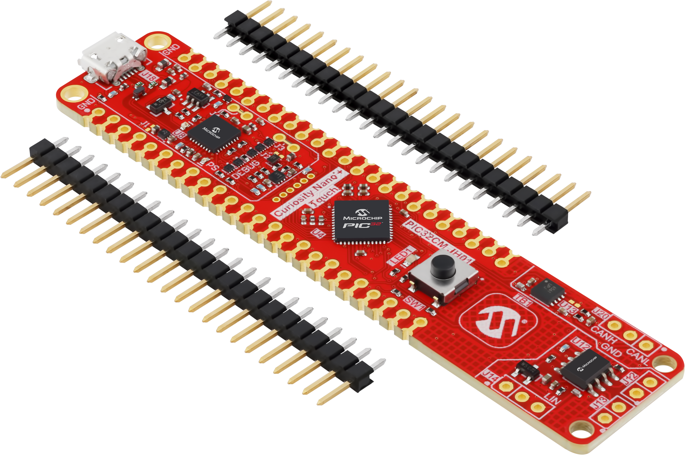

- [Curiosity Nano Explorer](https://www.microchip.com/en-us/development-tool/ev58g97a)  
     

- SanDisk microSDHC Ultra, 32GB, 100 Mbs, Class 10
     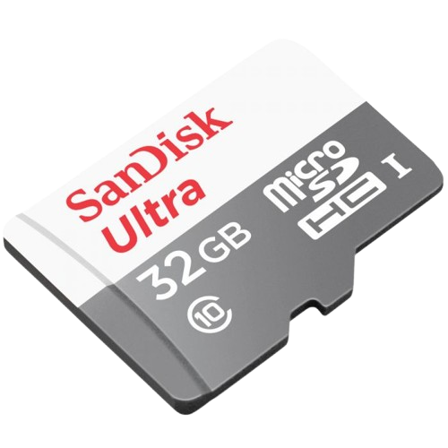

## Operation

To program the MCU with this MPLAB X project, follow the steps provided in the [How to Program the Microcontroller](#how-to-program-the-microcontroller) section.

## Concept

This project utilizes the PIC32CM JH01 Curiosity Nano and Curiosity Nano Explorer boards to implement a feature-rich audio recording and playback system. The PIC32CM5164JH01048 microcontroller provides advanced peripherals, including enhanced Analog-to-Digital Converters (ADC), Digital-to-Analog Converter (DAC), and Direct Memory Access Controller (DMAC), operating at a CPU frequency of 48 MHz — sufficient for real-time audio capture and playback. The Curiosity Nano Explorer board complements this with a microphone, speaker, SD card interface, push/touch buttons, one RGB LED, eight yellow light LEDs, WS2812 RGB LED strip, and an OLED display for user interaction and feedback. The system leverages MCC Harmony-generated FatFs, SDSPI, FreeRTOS, and MCU peripheral drivers for robust code implementation and multitasking support.

**Advanced Buffering and DMA Management:**

The application employs a dual-buffering scheme for audio playback and a triple-buffering scheme for audio recording. For playback, two statically allocated, 16-byte aligned buffers are managed by a DMAC linked list of descriptors, ensuring efficient and uninterrupted audio data transfer from the SD card to the DAC. For recording, three buffers are used, allowing continuous acquisition of audio data and writing to the SD card. This approach minimizes latency and maximizes throughput, enabling continuous data flow without waiting for one operation to finish before starting the next, and further reducing the risk of data loss or audio glitches. Each DMAC descriptor contains the buffer’s address, size, and the next descriptor in the sequence. The DMAC automatically cycles through these descriptors, transferring data from the ADC to the buffers (for recording) or from the buffers to the DAC (for playback) with minimal CPU intervention.

**Audio Data Acquisition and Processing:**

 - **Recording:** The ADC samples the microphone output, with 16 consecutive samples accumulated and averaged every 20,83 μs, resulting in an effective audio sampling rate of 48 kHz. The DMAC transfers these samples to the audio buffers. When a buffer is filled, the DMA switches to the next buffer, and an interrupt is triggered to write the filled buffer’s data to the SD card. The system supports real-time VU (volume unit) meter updates based on the audio amplitude, providing immediate feedback during recording.
 - **Playback:** The DAC reconstructs the audio signal, sending a new sample to the speaker every 20,83 μs to maintain the 48 kHz sampling frequency. The DMAC transfers audio samples from the buffers to the DAC output register. When a buffer is emptied, the DMA automatically switches to the next buffer, and an interrupt is triggered to refill the buffer with new data from the SD card. The system can play both mono, 10-bit unsigned audio and industry-standard 16-bit signed PCM audio, automatically converting and scaling samples for compatibility with the on-chip DAC.

**File System and WAV File Handling:**

The system operates with WAV type files. The application reads and parses WAV file headers to extract format information and updates the header after recording to reflect the correct file and data sizes. To optimize SD card access, the application performs dummy reads and writes to align file pointers with SD card cluster boundaries, significantly reducing read times and improving playback synchronization.

**User Interface and Controls:**

 - **Buttons:** The application features four push buttons and one touch button, with their functions dynamically changing depending on the current menu or state of the application. This context-sensitive approach allows intuitive control and navigation throughout the audio recording and playback process. SW1, SW2 and SW3 are located on the Curiosity Explorer board. On the Curiosity Nano board, the button labeled "SW1" on the silkscreen is referred to as SW4 in the application, and the touch button is designated as TB1.
   - **Idle State:**
     - SW1 initiates and starts the audio recording process
     - SW2 initiates the audio playback process and advances to the file selection menu
   - **File Selection Menu:**
     - SW1 cycles backwards through the list of avilable audio files on the SD card (previous file)
     - SW2 confirms the selected file starts the playback process
     - SW3 cycles forward through the list of available audio files on the SD card (next file)
   - **Recording State:**
     - SW1 resumes the recording if paused
     - SW2 pauses the recording
     - SW3 stops the recording and returns the system to the idle state
   - **Playback State:**
     - SW1 stops the playback and returns to the file selection menu
     - SW2 pauses or resumes the playback
     - SW3 stops the playback and returns the sustem to the idle state
     - SW4 cycles through the brightness options for the WS2812 LED strip
     - TB1 cycles through the hue interval options for the WS2812 LED strip

 - **Potentiometer:** Users can seek within audio files using a potentiometer (ADC input), with the application mapping ADC values to file offsets and ensuring proper alignment for SD card access. This enables fast, precise navigation within large audio files.

 - **OLED Display:** Displays file names (with scrolling), playback and record timestamps, and menu icons for user guidance. It utilizes direct memory access for efficient I2C data transfer, ensuring smooth, non-blocking updates.

 - **Yellow Light LEDs:** Eight VU meter LEDs display real-time audio amplitude during recording and playback.

 - **RGB LED:** Provides visual cues for different states: 
    - White: Idle
    - Blue: File selection menu
    - Magenta: Next file
    - Cyan: Previous file
    - Green: Playback
    - Red: Record
    - Yellow: Pause

  - **WS2812 RGB LED Strip:** Eight individually addressable LEDs display dynamic color and brightness based on audio amplitude and user-selected parameters. HSV-to-RGB conversion and smooth hue cycling are implemented, with brightness and hue interval options selectable via button and touch input.
  
**Application State Machine**

The application is structured as a state machine. State transitions are triggered by user input, hardware events, and DMA/timer callbacks, ensuring responsive and reliable operation.

**Error Handling and Recovery**

Robust error handling is implemented, with automatic unmounting and reinitialization in case of failures during file operations or hardware access, ensuring system reliability.

## MCU Peripherals and Hardware Interaction Diagram

 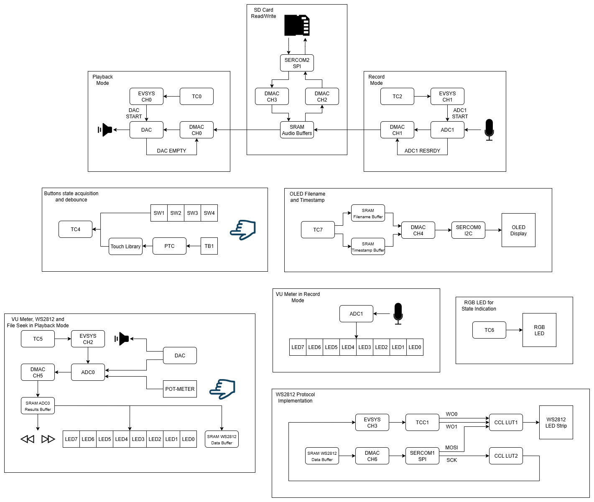

## Wiring Diagram

 

## Pin Table

| Pin ID | Custom Name |      Function      |    Explorer    |
| :----: | :---------: | :----------------: | :------------: |
|  PA00  |     DBG1    |        GPIO        |        -       |
|  PA01  |     DBG2    |        GPIO        |        -       |
|  PA02  |      -      | ADC0_AIN0/DAC_VOUT | SPEAKER AMP IN |
|  PA03  |     SW3     |        GPIO        |       SW3      |
|  PB08  |     SW1     |        GPIO        |       SW1      |
|  PB09  |      -      |     ADC1_AIN5      | MICROPHONE OUT |
|  PA04  |  LED_RED    |        GPIO        |    PWM_A OUT   |
|  PA05  |  LED_GREEN  |        GPIO        |    PWM_B OUT   |
|  PA06  |  LED_BLUE   |        GPIO        |    PWM_C OUT   |
|  PA07  |      -      |     ADC0_AIN7      |    POT-METER   |
|  PA08  |      -      |    SERCOM0_PAD0    |     I2C SDA    |
|  PA09  |      -      |    SERCOM0_PAD1    |     I2C SCL    |
|  PA10  |    LED6     |        GPIO        |      LED6      |
|  PA11  |      -      |      CCL_OUT1      |   WS2812B_RGB  |
|  PB10  |    LED2     |        GPIO        |      LED2      |
|  PB11  |    LED3     |        GPIO        |      LED3      |
|  PA12  |      -      |    SERCOM2_PAD0    |    SPI MOSI    |
|  PA13  |      -      |    SERCOM2_PAD1    |    SPI SCK     |
|  PA14  |    LED4     |        GPIO        |      LED4      |
|  PA15  |      -      |    SERCOM2_PAD3    |    SPI MISO    |
|  PA19  |      -      |    SERCOM1_PAD3    |     PIN 14     |
|  PA20  |   uSD_CS    |        GPIO        |     uSD CS     |
|  PA21  |    LED5     |        GPIO        |      LED5      |
|  PA22  |    LED0     |        GPIO        |      LED0      |
|  PA23  |    LED1     |        GPIO        |      LED1      |
|  PA24  |      -      |       CCL_IN8      |     PIN 12     |
|  PA25  |     SW2     |        GPIO        |       SW2      |
|  PA27  |     SW4     |        GPIO        |       SW4      |
|  PA28  |    LED7     |        GPIO        |      LED7      |
|  PB02  |      -      |       PTC_Y8       |        -       |

## Demonstration

**Idle State**
 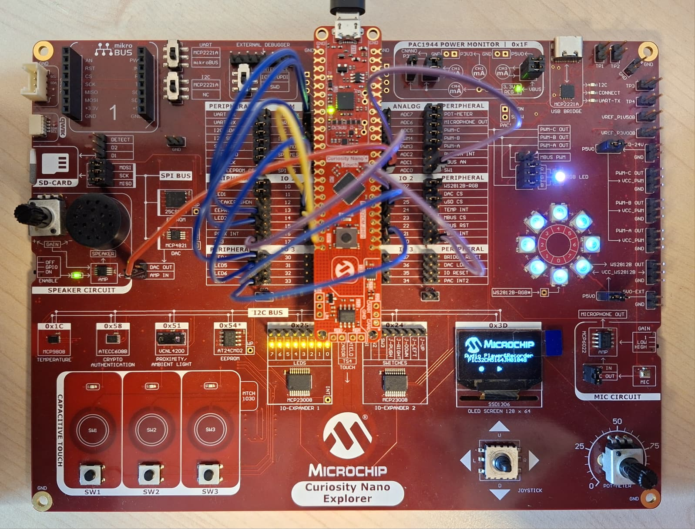

**Record State**
 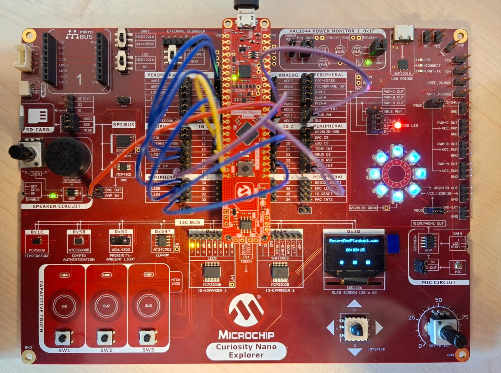

**Selection Menu State**
 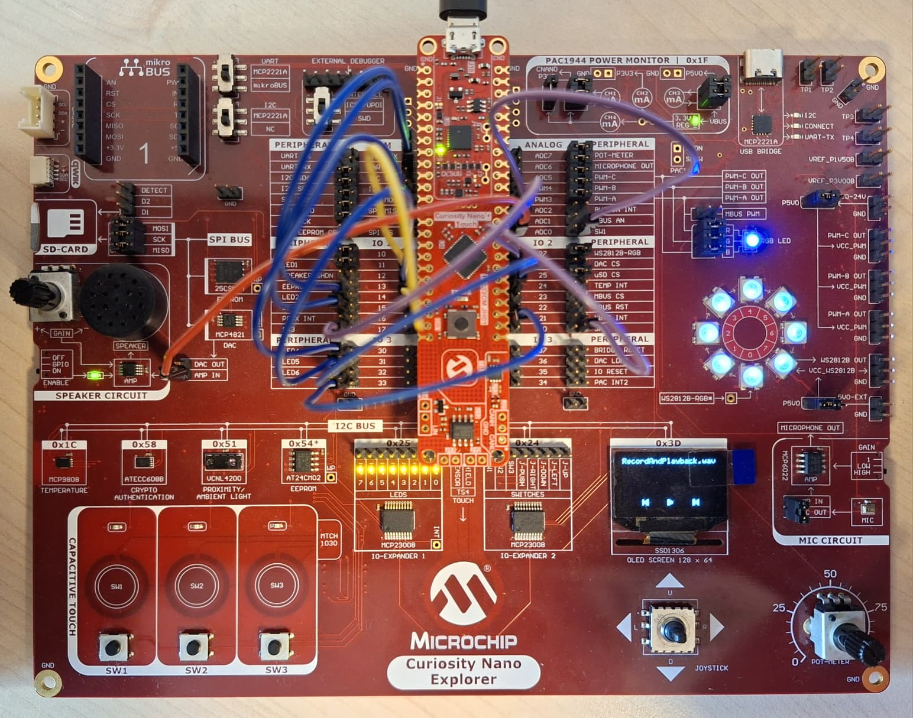

**Playback State**
 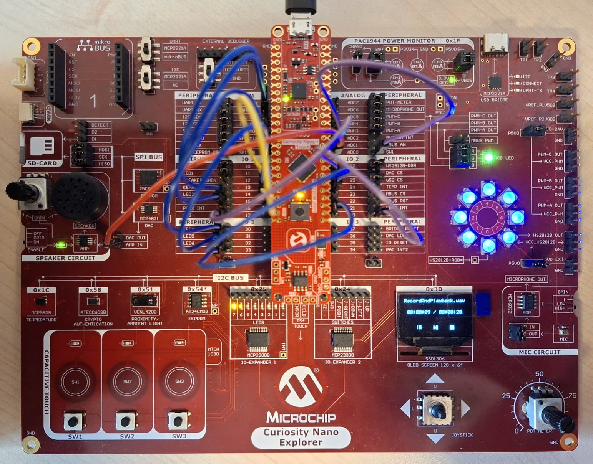

**Pause State**
 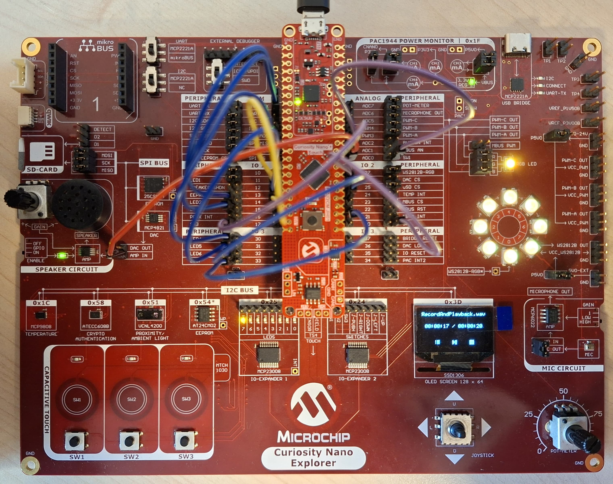

**Demonstration video**
 

## Summary

This project demonstrates a comprehensive, real-time audio recording and playback system with advanced hardware integration, efficient DMA-based data management, and a rich user interface. The combination of double/triple-buffering, DMAC linked list, file system optimization, and interactive controls ensures seamless, glitch-free audio performance and an intuitive user experience.

**Summary of Featured Functionalities:**
 - Double/Triple audio buffer management reduces latency and improves DMA efficiency for audio streaming
 - DMA linked list descriptors enables continuous, ping-pong buffer transfers for playback and recording
 - WAV header parsing and updating ensures correct audio format handling and file size management
 - File system cluster/block alignment optimizes SD card access speed and synchronization
 - Buttons handling offer multi-function controls for playback, recording, navigation, and settings
 - File seek via ADC input allows users to seek within audio files using a potentiometer
 - OLED display with DMA I2C transfer implements real-time file name scrolling and timestamp display
 - RGB LED and VU meter integration offer visual feedback for application state and audio amplitude
 - WS2812 LED strip control provides dynamic color and brightness based on audio amplitude and user input
 - Error handling and recovery offers automatic unmount and reinitialization on file or hardware errors

##  How to Program the Microcontroller

This chapter demonstrates how to use the MPLAB X IDE to program a PIC® device with an Example_Project.X. This is applicable to other projects, too.

1.  Connect the board to the PC.

2.  Open the `Example_Project.X` project in MPLAB X IDE.

3.  Set the `Example_Project.X` project as main project.
     Right click the project in the **Projects** tab and click **Set as Main Project**.
     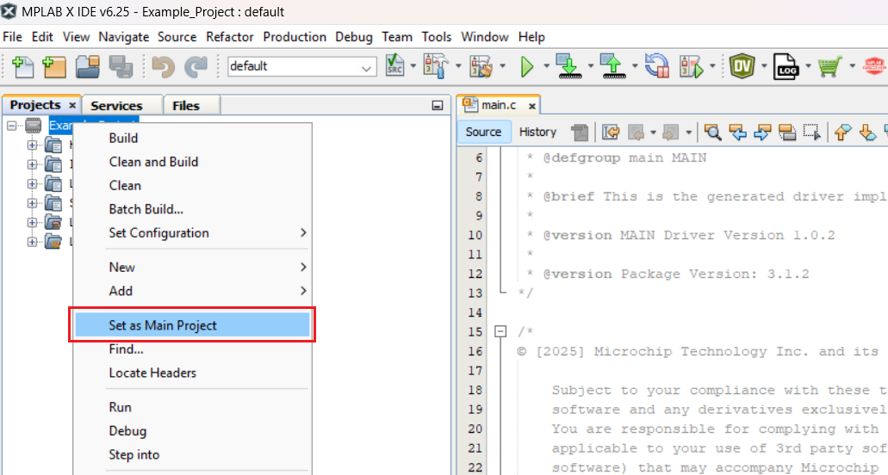

4.  Clean and build the `Example_Project.X` project.
     Right click the `Example_Project.X` project and select **Clean and Build**.
     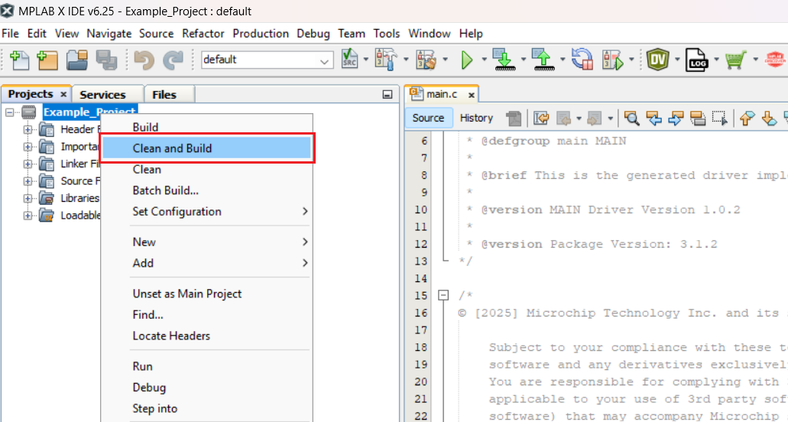

5.  Select PICxxxxx Curiosity Nano in the Connected Hardware Tool section of the project settings:
     Right click the project and click **Properties**.
     Click the arrow under the Connected Hardware Tool.
     Select PICxxxxx Curiosity Nano (click the SN), click **Apply** and then click **OK**:
     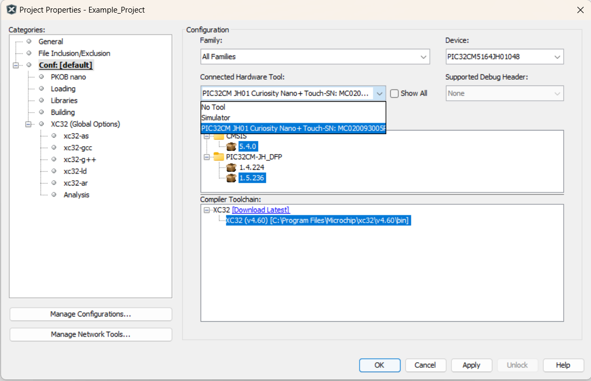
     **Note**: Other PICkit versions can be used as well.

6.  Program the project to the board.
     Right click the project and click **Make and Program Device**.
     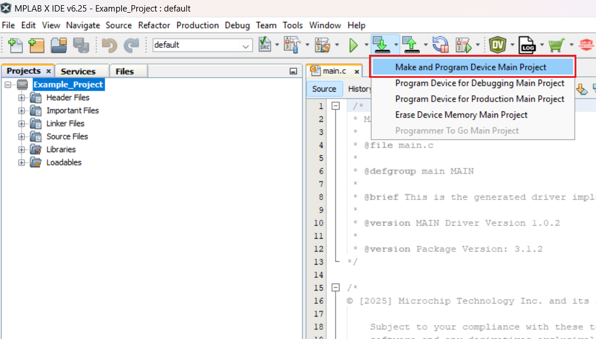

 

- - - 
## Menu
- [Back to Top](#audio-player-and-recorder-using-the-pic32cm5164jh01048-microcontroller-based-on-the-arm-cortex-m0-processor)
- [Back to Related Documentation](#related-documentation)
- [Back to Software Used](#software-used)
- [Back to Hardware Used](#hardware-used)
- [Back to Operation](#operation)
- [Back to Concept](#concept)
- [Back to MCU Peripherals and Hardware Interaction Diagram](#mcu-peripherals-and-hardware-interaction-diagram)
- [Back to Wiring Diagram](#wiring-diagram)
- [Back to Pin Table](#pin-table)
- [Back to Demonstration](#demonstration)
- [Back to Summary](#summary)
- [Back to How to Program the Microcontroller](#how-to-program-the-microcontroller)
